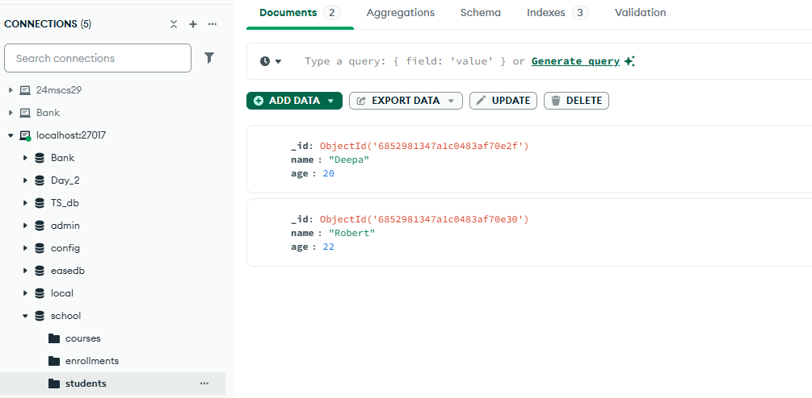
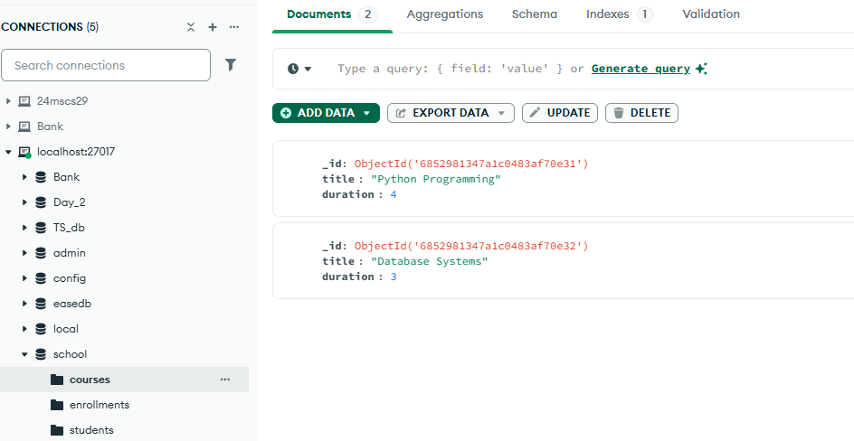
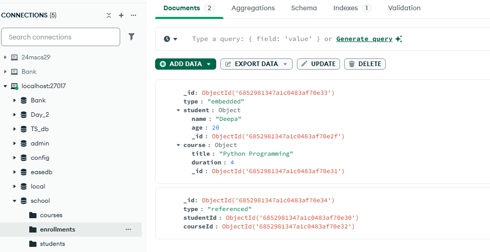
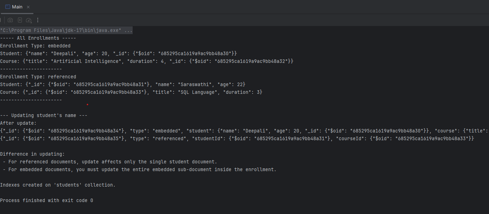

# 💻 Backend Internship - Java & MongoDB

This repository contains internship tasks focused on backend development using Java and MongoDB. It includes hands-on practice with core Java concepts, object-oriented programming, and exception handling. We also explored project management using Maven and dependency integration. Basic MongoDB operations were applied in a Java banking simulation. Each day covers both coding tasks and relevant study materials.

Here's your complete **Day 3 section** to add to your existing README, including references to the screenshots from your Java project's `img` folder (you mentioned the images are: `course.png`, `enrollment.png`, and `student.png` inside an `img` directory).

## ✅ Day 3: Student Enrollment Using MongoDB (Java + Maven)

### 🔧 Task Overview

The goal of this project was to implement a **Java console application** that interacts with **MongoDB** to manage student enrollments in courses. This application demonstrates the difference between **embedded** and **referenced** document structures in MongoDB.

### 📦 Collections Used

* `students` — stores student details
* `courses` — stores course details
* `enrollments` — stores enrollment records

### 📄 Document Structures

* In the `enrollments` collection:

  * One document **embeds** both student and course information directly inside the enrollment.
  * Another document **references** the student and course using their ObjectIds.

---

### 🚀 Features Implemented

1. **Inserted sample data** for students and courses.
2. **Created enrollments**:

   * One using **embedded documents**.
   * Another using **referenced documents**.
3. **Queried and printed** both types of enrollments with complete details.
4. **Updated a student's name**:

   * In the **embedded** case: Updated directly inside the enrollment document.
   * In the **referenced** case: Updated in the `students` collection, automatically reflected wherever referenced.
5. **Created indexes** on the `students` collection for efficient querying.

---

### 🧠 Key Learning

* Embedded documents are denormalized — changing data in one place doesn’t reflect elsewhere.
* Referenced documents support reuse and normalization — ideal for scalable applications.
* Indexes improve performance significantly on frequently queried fields.

---

### 🖼️ Screenshots from MongoDB Compass

#### 📘 Students Collection

---

#### 📗 Courses Collection

---

#### 📕 Enrollments Collection (Embedded vs Referenced)

---

#### 📕 Terminal Output

 
---
